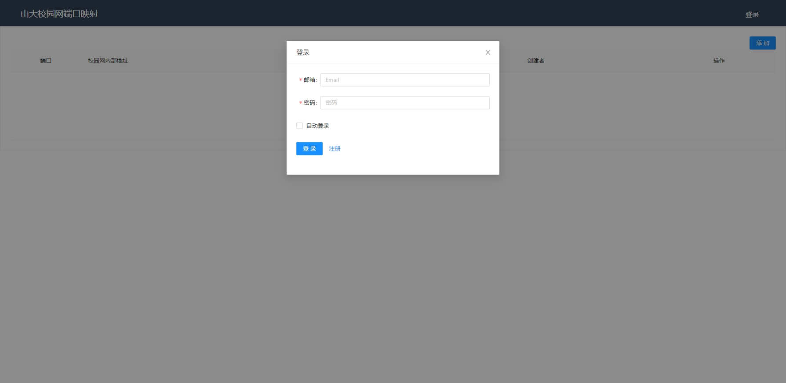
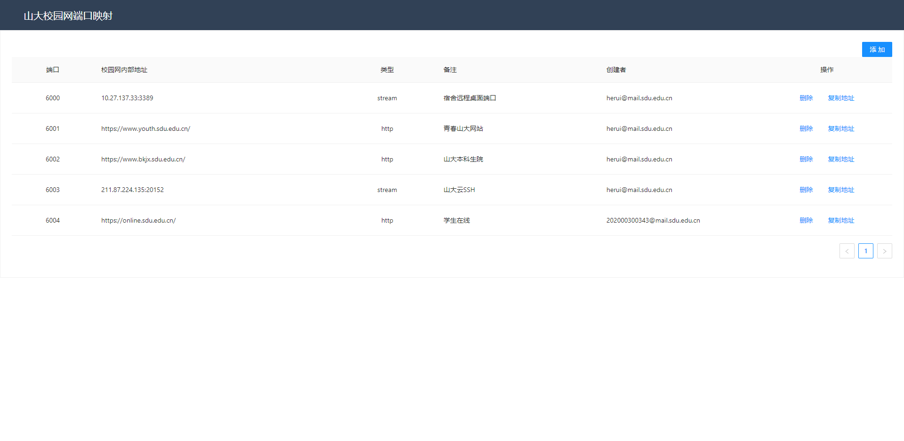
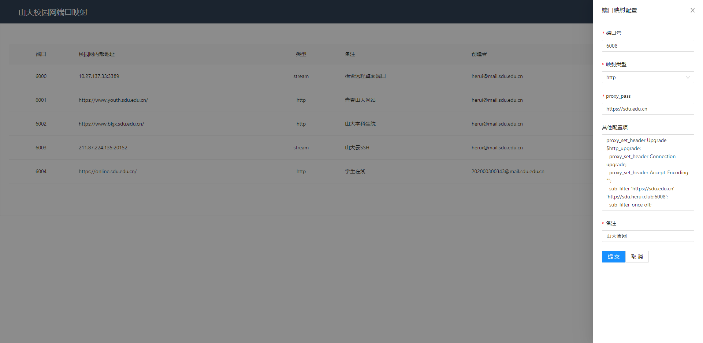

# 山东大学 校园网公网端口映射 (SDU Port Mapper)

项目地址：

[https://sdu.herui.club](https://sdu.herui.club)

鸣谢：

[@Hagb 的 docker-easyconnect 项目](https://github.com/Hagb/docker-easyconnect)

---







大致思路是将容器化的 easyconnect 部署在公网服务器上，通过 容器内 nginx 反向代理校内网端口实现公网映射的功能。因每次 ssh 上服务器手动增删映射配置较为麻烦，故开发为 web 前后端方便管理。

---

# 前端部分

前端采用 react + antd 进行页面设计，使用 [rap2](http://rap2.taobao.org/) 进行接口管理和类型代码生成，若有接口修改需要，可以使用[rap 配置导出地址](http://rap2api.taobao.org/repository/get?id=282201)在 rap2 平台上创建自己的仓库并导入 (同时需要修改 package.json 中的 rapper 脚本) ，也可以在 frontend/rapper/中进行自定义修改，还可以直接放弃 rap2，手写类型和请求代码。

请求 URL 前缀在 frontend/src/constants/fetch.ts 中自定义：

```ts
// frontend/constants/fetch.ts
export const FETCH_ROOT_URL = 'https://sdu.herui.club/api';
```

注册时在 frontend/src/components/layout.tsx 中有表单验证：邮箱只限山大邮箱。如需修改可将对应的 <From.Item> 部分的 rules 校验规则修改即可。

以下命令以 frontend/ 为工作目录：

安装 npm 包：`yarn`

调试模式启动：`yarn start`

生产模式打包：`yarn build`

使用 rap 更新接口数据：`yarn rapper`

# 后端部分

后端框架采用 koa2，同时配置了 webpack 实现打包为单文件，方便服务器直接部署。

以下命令以 backend/ 为工作目录：

首先安装 npm 包：`yarn`

配置 config.json：

```json
// backend/config.json
{
  "port": 2333, //后端服务器运行的端口号
  "mysql": {
    //mysql数据库的配置项，用于存储用户信息和端口映射数据，数据库表结构在backend/MysqlSchema.sql中给出，使用mysql执行此文件即可自动创建并初始化
    "hostname": "",
    "port": 3306,
    "username": "",
    "password": "",
    "database": ""
  },
  "redis": {
    //redis数据库，用于存取token进行注册和登录信息验证
    "hostname": "",
    "port": 6379,
    "password": ""
  },
  "smtp": {
    //smtp邮件服务器配置，用于发送邮件验证码完成注册
    "host": "",
    "port": 465,
    "secure": true,
    "auth": {
      "user": "",
      "pass": ""
    }
  }
}
```

后端服务器需要在 easyconnect 容器外使用命令行操作 docker 容器，docker 容器内需要安装 nginx 并启动，并创建/etc/nginx/stream 目录和/etc/nginx/http 目录用于存放配置文件，同时挂载宿主机中的/root/.config/easyconnect/http、/root/.config/easyconnect/stream 到相应目录中去。一个典型的 docker 启动脚本如下：

```bash
docker run --device /dev/net/tun --cap-add NET_ADMIN -ti \
        -v $HOME/.easyconn:/root/.easyconn \  #easyconnect的登录凭据，第一次成功登录后会自动创建并自动登录
        -v $HOME/.config/easyconnect/http:/etc/nginx/http \  #存放http类型的反代配置文件
        -v $HOME/.config/easyconnect/stream:/etc/nginx/stream \ #存放stream类型的端口映射配置文件
        -v $HOME/.config/easyconnect/sites:/var/www/html \ #前端管理平台静态资源
        -p 5999-6050:5999-6050 \ #暴露容器内可供配置的端口
        -e EC_VER=7.6.3 --name easyconnect -d hagb/docker-easyconnect:cli  #以后台方式启动，注意第一次启动时不要带参数 -d 后台启动，因为要输入账号密码信息进行登录
```

容器内一个典型的 nginx 配置文件 /etc/nginx/nginx.conf 如下：

```bash
user www-data;
worker_processes auto;
pid /run/nginx.pid;
include /etc/nginx/modules-enabled/*.conf;
events {
        worker_connections 768;
}
stream {
        include /etc/nginx/stream/*; #将stream中的配置文件包含进来
}
http {
        sendfile on;
        tcp_nopush on;
        tcp_nodelay on;
        keepalive_timeout 65;
        types_hash_max_size 2048;
        include /etc/nginx/mime.types;
        default_type application/octet-stream;
        ssl_protocols TLSv1 TLSv1.1 TLSv1.2; # Dropping SSLv3, ref: POODLE
        ssl_prefer_server_ciphers on;
        access_log /var/log/nginx/access.log;
        error_log /var/log/nginx/error.log;
        gzip on;

        include /etc/nginx/conf.d/*.conf;
        include /etc/nginx/http/*; #将http中的配置文件包含进来
        include /etc/nginx/sites-enabled/*;
}
```

直接启动：`yarn start`

调试模式启动 (文件更新时自动重启后端)：`yarn dev`

打包为单文件：`yarn build`

更新 rap 接口定义：`yarn rapper`

下一步计划制作已经配置好的 docker 镜像，方便直接部署
